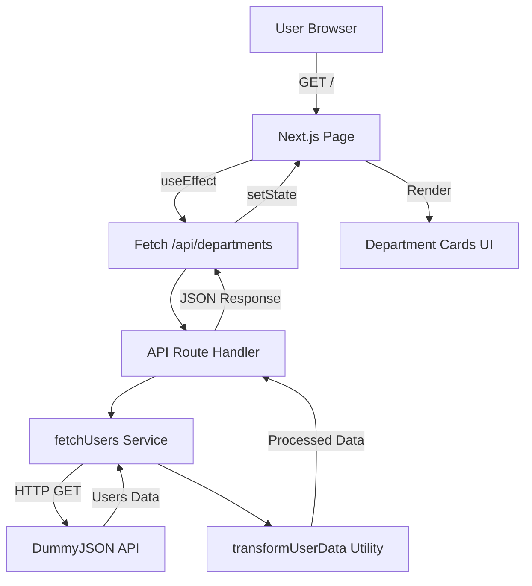

# User Department Analyzer

> แอปพลิเคชันวิเคราะห์ข้อมูลผู้ใช้แยกตามแผนก พัฒนาด้วย Next.js และ TypeScript

## 📋 ภาพรวมโปรเจค

**User Department Analyzer** เป็นเว็บแอปพลิเคชันที่ออกแบบมาเพื่อดึงข้อมูลผู้ใช้จาก API ภายนอก ([DummyJSON](https://dummyjson.com)) และวิเคราะห์ข้อมูลโดยจัดกลุ่มตามแผนกที่ผู้ใช้สังกัด พร้อมแสดงสถิติต่างๆ เช่น จำนวนเพศ, ช่วงอายุ, สีผม และที่อยู่ของผู้ใช้

โปรเจคนี้ใช้ Next.js Pages Router พร้อมกับ TypeScript เพื่อความปลอดภัยของ type และมีการเขียน unit tests ด้วย Jest

---

## ✨ คุณสมบัติหลัก

### 🎯 ฟีเจอร์หลัก

1. **การวิเคราะห์ข้อมูลผู้ใช้ตามแผนก**

   - ดึงข้อมูลผู้ใช้จาก DummyJSON API
   - จัดกลุ่มและวิเคราะห์ข้อมูลตามแผนกที่สังกัด
   - แสดงสถิติแยกตามเพศ (ชาย/หญิง)
   - คำนวณช่วงอายุของพนักงานในแต่ละแผนก
   - นับจำนวนสีผมแยกตามประเภท
   - แสดงรายชื่อและรหัสไปรษณีย์ของผู้ใช้

2. **Auto-Delete Todo List** (Demo Page)

   - หน้าสาธิตการจัดการรายการ Fruit และ Vegetable
   - ระบบ auto-return หลังจาก 5 วินาที
   - UI แบบ drag-and-drop style

3. **API Routes**
   - `/api/departments` - ดึงข้อมูลที่วิเคราะห์แล้วตามแผนก
   - `/api/hello` - API endpoint ตัวอย่าง

### 🏗️ สถาปัตยกรรม

โปรเจคใช้สถาปัตยกรรมแบบ **Layered Architecture**:

```
┌─────────────────────────────────────┐
│         Presentation Layer          │
│    (Pages, Components, UI)          │
└──────────────┬──────────────────────┘
               │
┌──────────────▼──────────────────────┐
│          API Routes Layer           │
│    (Next.js API Routes)             │
└──────────────┬──────────────────────┘
               │
┌──────────────▼──────────────────────┐
│         Business Logic Layer        │
│    (Services, Utils, Transform)     │
└──────────────┬──────────────────────┘
               │
┌──────────────▼──────────────────────┐
│         External API Layer          │
│    (DummyJSON API)                  │
└─────────────────────────────────────┘
```

**Data Flow:**

1. User เข้าหน้า Home Page (`/`)
2. Frontend เรียก API `/api/departments`
3. API Route เรียก `fetchUsers()` จาก `userService`
4. ข้อมูลถูกแปลงผ่าน `transformUserData()` utility
5. ส่งข้อมูลที่แปลงแล้วกลับไปยัง Frontend
6. แสดงผลในรูปแบบ cards แยกตามแผนก

---

## 🛠️ Tech Stack

### Core Technologies

- **Framework:** [Next.js 15.1.7](https://nextjs.org/) (Pages Router)
- **Language:** [TypeScript 5](https://www.typescriptlang.org/)
- **Runtime:** [React 19.0.0](https://react.dev/)
- **Styling:** [Tailwind CSS 3.4.1](https://tailwindcss.com/)

### Development Tools

- **HTTP Client:** [Axios 1.8.0](https://axios-http.com/)
- **Testing Framework:** [Jest 29.7.0](https://jestjs.io/)
- **Testing Library:** [@testing-library/react 16.2.0](https://testing-library.com/)
- **Linting:** [ESLint 9](https://eslint.org/)
- **Package Manager:** npm / pnpm

### Build & Development

- **Turbopack:** เปิดใช้งานสำหรับ dev mode (`--turbopack`)
- **TypeScript Compiler:** Strict mode enabled
- **Module Resolution:** Bundler mode

---

## 📦 การติดตั้ง

### ความต้องการของระบบ

- Node.js 20.x หรือสูงกว่า
- npm, yarn, pnpm หรือ bun

### ขั้นตอนการติดตั้ง

1. **Clone repository**

```bash
git clone <repository-url>
cd user-analyzer
```

2. **ติดตั้ง dependencies**

```bash
npm install
# หรือ
pnpm install
# หรือ
yarn install
```

3. **รัน development server**

```bash
npm run dev
# หรือ
pnpm dev
# หรือ
yarn dev
```

4. **เปิดเบราว์เซอร์**
   - ไปที่ [http://localhost:3000](http://localhost:3000)
   - หน้า Department Analysis จะแสดงข้อมูลที่วิเคราะห์แล้ว
   - ไปที่ [http://localhost:3000/todo](http://localhost:3000/todo) เพื่อดู Auto-Delete Todo List

---

## 🚀 การใช้งาน

### Available Scripts

```bash
# Development
npm run dev          # รัน dev server พร้อม Turbopack

# Production
npm run build        # Build สำหรับ production
npm run start        # รัน production server

# Testing
npm run test         # รัน tests
npm run test:watch   # รัน tests ในโหมด watch
npm run test:coverage # รัน tests พร้อม coverage report

# Linting
npm run lint         # ตรวจสอบ code ด้วย ESLint
```

### API Endpoints

#### `GET /api/departments`

ดึงข้อมูลผู้ใช้ที่วิเคราะห์แล้วแยกตามแผนก

**Response Example:**

```json
{
  "Engineering": {
    "male": 15,
    "female": 12,
    "ageRange": "25-45",
    "hair": {
      "Black": 10,
      "Brown": 8,
      "Blonde": 5,
      "Red": 4
    },
    "addressUser": {
      "JohnDoe": "10001",
      "JaneSmith": "10002"
    }
  },
  "Marketing": {
    "male": 8,
    "female": 10,
    "ageRange": "23-40",
    "hair": {
      "Brown": 7,
      "Black": 6,
      "Blonde": 5
    },
    "addressUser": {
      "MikeJohnson": "20001"
    }
  }
}
```

#### `GET /api/hello`

API endpoint ตัวอย่างจาก Next.js template

**Response:**

```json
{
  "name": "John Doe"
}
```

---

## 🧪 Testing

โปรเจคมีการเขียน unit tests ด้วย Jest และ Testing Library

### รัน Tests

```bash
# รัน tests ทั้งหมด
npm run test

# รัน tests ในโหมด watch
npm run test:watch

# ดู test coverage
npm run test:coverage
```

### Test Coverage

ปัจจุบันมี test coverage สำหรับ:

- ✅ `transformUserData` utility function
- ✅ การจัดการข้อมูลผู้ใช้ที่ไม่มีแผนก
- ✅ การจัดการ empty array

**Test Files:**

- `src/services/__tests__/userService.test.ts`

---

## 📁 โครงสร้างโปรเจค

```
user-analyzer/
├── src/
│   ├── app/                      # App Router (ใช้สำหรับ API routes)
│   │   └── api/
│   │       └── departments/
│   │           └── route.ts      # API endpoint สำหรับดึงข้อมูลแผนก
│   │
│   ├── pages/                    # Pages Router
│   │   ├── _app.tsx              # Custom App component
│   │   ├── _document.tsx         # Custom Document
│   │   ├── index.tsx             # หน้าแรก - Department Analysis
│   │   ├── todo/
│   │   │   └── index.tsx         # Auto-Delete Todo List demo
│   │   └── api/
│   │       └── hello.ts          # API route ตัวอย่าง
│   │
│   ├── services/                 # Business logic layer
│   │   ├── userService.ts        # Service สำหรับดึงข้อมูลผู้ใช้
│   │   └── __tests__/
│   │       └── userService.test.ts
│   │
│   ├── utils/                    # Utility functions
│   │   └── transformUserData.ts  # แปลงข้อมูลผู้ใช้ตามแผนก
│   │
│   ├── types/                    # TypeScript type definitions
│   │   └── user.types.ts         # Types สำหรับ User และ Department
│   │
│   └── styles/                   # Global styles
│       └── globals.css           # Tailwind CSS และ global styles
│
├── public/                       # Static assets
│   ├── favicon.ico
│   └── *.svg                     # SVG icons
│
├── .next/                        # Next.js build output
├── node_modules/                 # Dependencies
│
├── jest.config.mjs               # Jest configuration
├── jest.setup.js                 # Jest setup file
├── next.config.ts                # Next.js configuration
├── tsconfig.json                 # TypeScript configuration
├── tailwind.config.ts            # Tailwind CSS configuration
├── postcss.config.mjs            # PostCSS configuration
├── eslint.config.mjs             # ESLint configuration
├── package.json                  # Project dependencies
└── README.md                     # Project documentation
```

---

## 🔑 Key Components

### 1. User Service (`src/services/userService.ts`)

- ดึงข้อมูลผู้ใช้จาก DummyJSON API
- รองรับการกำหนด limit ของจำนวนผู้ใช้
- Error handling และ logging

### 2. Transform Utility (`src/utils/transformUserData.ts`)

- แปลงข้อมูลผู้ใช้ให้อยู่ในรูปแบบที่ต้องการ
- ใช้ Map สำหรับประสิทธิภาพในการประมวลผล
- จัดกลุ่มข้อมูลตามแผนก
- คำนวณสถิติต่างๆ (เพศ, อายุ, สีผม, ที่อยู่)

### 3. Type Definitions (`src/types/user.types.ts`)

- `User` - Interface สำหรับข้อมูลผู้ใช้จาก API
- `UsersResponse` - Interface สำหรับ response จาก API
- `DepartmentData` - Interface สำหรับข้อมูลแต่ละแผนก
- `TransformedData` - Interface สำหรับข้อมูลที่แปลงแล้ว

### 4. API Route (`src/app/api/departments/route.ts`)

- Next.js App Router API endpoint
- เรียกใช้ service และ utility functions
- Error handling และ response formatting

### 5. Home Page (`src/pages/index.tsx`)

- แสดงข้อมูลแผนกในรูปแบบ grid cards
- Loading และ error states
- Responsive design ด้วย Tailwind CSS

---

## 🎨 UI/UX Features

- **Responsive Design:** รองรับทุกขนาดหน้าจอ (mobile, tablet, desktop)
- **Loading States:** แสดง loading indicator ขณะดึงข้อมูล
- **Error Handling:** แสดงข้อความ error ที่เป็นมิตรกับผู้ใช้
- **Card Layout:** แสดงข้อมูลแต่ละแผนกในรูปแบบ card พร้อม shadow
- **Scrollable Tables:** ตารางที่อยู่สามารถ scroll ได้เมื่อข้อมูลเยอะ
- **Color Coding:** ใช้สีแยกประเภทข้อมูล (Fruit = แดง, Vegetable = เขียว)

---

## 🔧 Configuration Files

### TypeScript (`tsconfig.json`)

- **Target:** ES2017
- **Strict Mode:** Enabled
- **Path Aliases:** `@/*` → `./src/*`
- **Module Resolution:** Bundler mode

### Tailwind CSS (`tailwind.config.ts`)

- รองรับไฟล์ `.ts`, `.tsx` ใน `src/` และ `pages/`
- Custom theme configuration

### Jest (`jest.config.mjs`)

- **Test Environment:** jsdom (สำหรับ React components)
- **Transform:** ts-jest สำหรับ TypeScript
- **Module Mapper:** รองรับ path alias `@/*`
- **Test Pattern:** `**/__tests__/**/*.test.(ts|tsx|js|jsx)`

---

## 📊 Data Flow Diagram



---

## 🚧 Future Improvements

- [ ] เพิ่ม data visualization ด้วย charts (Chart.js หรือ Recharts)
- [ ] เพิ่ม filtering และ sorting capabilities
- [ ] เพิ่ม pagination สำหรับข้อมูลจำนวนมาก
- [ ] เพิ่ม export ข้อมูลเป็น CSV/Excel
- [ ] เพิ่ม dark mode support
- [ ] เพิ่ม search functionality
- [ ] เพิ่ม caching ด้วย React Query หรือ SWR
- [ ] เพิ่ม E2E tests ด้วย Playwright หรือ Cypress
- [ ] เพิ่ม CI/CD pipeline
- [ ] Deploy to Vercel/Netlify

---

## 📝 License

This project is private and not licensed for public use.

---

## 👨‍💻 Developer Notes

### Path Aliases

โปรเจคใช้ path alias `@/` เพื่อ import จาก `src/` directory:

```typescript
import { User } from "@/types/user.types";
import { fetchUsers } from "@/services/userService";
```

### API Limitations

- DummyJSON API มีข้อจำกัดในการดึงข้อมูล (default limit: 100 users)
- ข้อมูลเป็น mock data ไม่ใช่ข้อมูลจริง

### Performance Considerations

- ใช้ `Map` แทน `Object` ในการประมวลผลข้อมูลเพื่อประสิทธิภาพที่ดีกว่า
- Single-pass algorithm ในการ transform ข้อมูล
- Memoization อาจจะเพิ่มได้ในอนาคตสำหรับ expensive computations

---

## 📞 Support

หากพบปัญหาหรือมีคำถาม กรุณาติดต่อทีมพัฒนา

---

**Built with ❤️ using Next.js and TypeScript**
